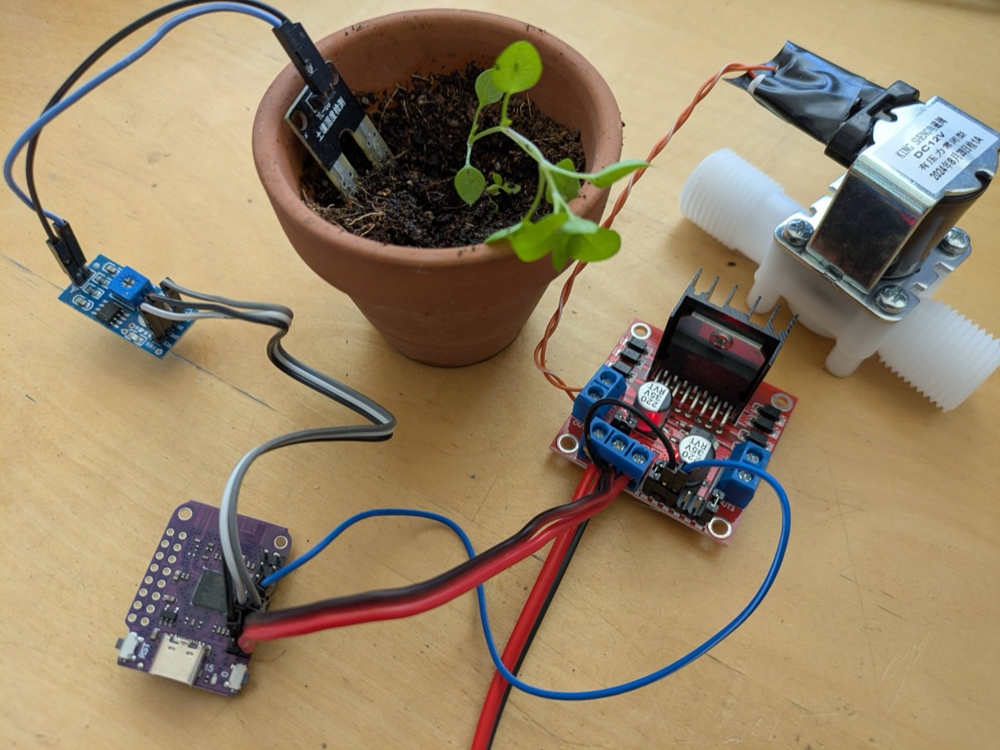
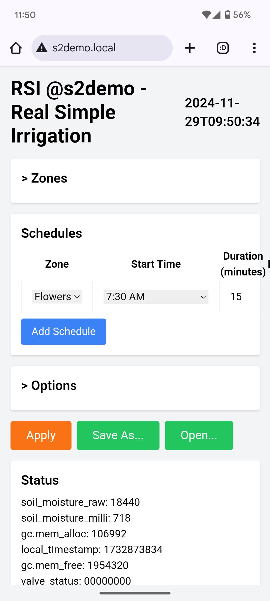
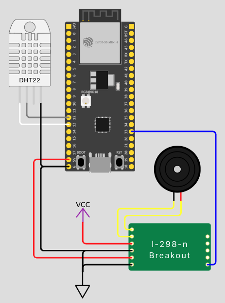
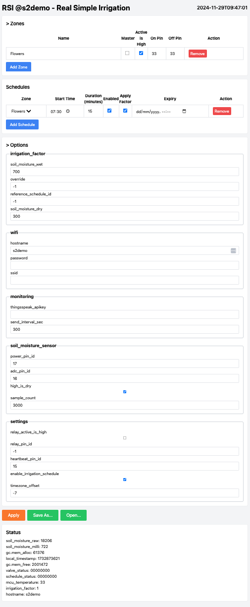

# RSI - Real Simple Irrigation



## Design Philosophy
1. Easy to source generic components
1. Cheap - cost could be as low as $10 (including the valve)
1. Easy to setup
    * Few components
    * No soldering required
1. Scheduled watering based on soil moisture

## UI


# Hardware

## Diagram


[View Project on Wokwi](https://wokwi.com/projects/412802920651096065)

## Cost Breakdown
| Component | Spec | Cost |
| --- | --- | --- |
| Controller | ESP32-S2 | $2 |
| Soil moisture sensor | LM393 | $1 |
| Driver | L298N | $1.5 |
| Valve | 1/2" Solenoid 12V DC (Plastic) | $3.5 |
| Jumper wires | 10cm F-F | $0.5 |
| Power supply | 12V DC 1A | $1.5 |
| **Total** | | **$10** |

## Controller
This project is based on [ESP32-S2](https://www.espressif.com/en/products/socs/esp32-s2) + [MicroPython](https://docs.micropython.org/en/latest/esp32/quickref.html)

### Considerations
1. Built-in WiFi
1. [Lots of GPIOs](https://www.sudo.is/docs/esphome/boards/esp32s2mini/ESP32_S2_mini_pinout.jpg)
1. Easy to use - [Thonny (Python IDE)](https://thonny.org/)
1. Cheap

### Previous Iterations
1. Starting with a simple Digispark solution (Arduino based)
1. Followed by [WeAct RP2040](https://github.com/WeActStudio/WeActStudio.RP2040CoreBoard) + MicroPython - this solution lacked network connectivity
1. Raspberry Pi Zero W - bit of an overkill, there's no need for a full Linux system
1. [LOLIN D1 mini - ESP8266](https://www.wemos.cc/en/latest/d1/d1_mini.html) + MicroPython - too little memory (met limit on global strings)

## Valve / Pump

### Valves
1. DC Latching solenoid - Draws power only on state change [Bermad S-392T-2W](https://catalog.bermad.com/BERMAD%20Assets/Irrigation/Solenoids/IR-SOLENOID-S-392T-2W/IR_Accessories-Solenoid-S-392T-2W_Product-Page_English_2-2020_XSB.pdf)

### Pumps
1. DC pump - [12V DC pump](https://www.google.com/search?q=12v+dc+pump)

## Driver
Depends on the valve/pump used:
1. [Mechanical relays (Multi relay module)](https://www.google.com/search?q=Mechanical+multi+relay+module) - most versatile, compatible with AC, DC & reverse polarity
1. Solid state relays (Multi relay module) - compatible with DC only - no reverse polarity
1. [H-Bridge L298N](https://www.hibit.dev/posts/89/how-to-use-the-l298n-motor-driver-module) - for closing by reversing polarity

## Power Supply
Depends on the valve/pump used. The controller may be powered by a USB charger or VBUS pin.
Note: The H-Bridge L298N has an onboard 5V regulator which can be used to power the controller via the VBUS pin.

## [Soil Moisture Sensor](https://www.google.com/search?q=soil+moisture+sensor) (Optional)

## Master Relay (Optional)
1. Saves power when waiting for the next watering cycle

# Software

## IoT Backend Options
1. [Thingspeak](https://thingspeak.com/) - [Video](https://www.youtube.com/watch?v=Ckf3zzCA5os)
1. [Blynk](https://blynk.io/) - [Video](https://www.youtube.com/watch?v=gCUyTRL9YRA)

## References
1. 

### Pinout
* [ESP8266 D1 Mini](https://www.sudo.is/docs/esphome/boards/esp8266d1mini/#pinout)
* [ESP32-S2 Mini](https://www.sudo.is/docs/esphome/boards/esp32s2mini/ESP32_S2_mini_pinout.jpg)
* [ESP32-S3](https://docs.espressif.com/projects/esp-idf/en/stable/esp32s3/_images/ESP32-S3_DevKitM-1_pinlayout.jpg) 

# Setup

## Initial Setup
1. Using Thonny, copy `main.py`, `index.html`, `setup.html` to the ESP32.
1. Reset & enter WiFi setup mode by pressing the button within 1 second. The LED will blink rapidly.
1. Connect to the ESP32's WiFi `irrigation-esp32` and configure the WiFi settings.

## Configuration

### UI


### Zones (Valves)
1. **Master**: This zone will be turned on before any other zone and turned off after all zones are turned off.
1. **On Pin / Off Pin**: The GPIO pin number to control the valve. If a latching valve is used, assign a different pin ID for on/off.

### Schedules
1. **Apply Factor**: Apply factor to the watering time. The factor is determined by the `irrigation_factor` section in the options.

### Options

#### irrigation_factor
1. **reference_schedule_id**: The schedule ID used as a reference to calculate the irrigation factor.
1. **soil_moisture_dry**: If the soil moisture is below this value, irrigation will start.
1. **soil_moisture_wet**: If the soil moisture reaches this value, irrigation will stop and `irrigation_factor` will be assigned the relative time needed to reach the wet value.
1. **override**: Manual override for the `irrigation_factor`. `-1` means no override.

#### wifi
1. **hostname**: The hostname of the controller, allows connecting to the controller using the hostname.local.
1. **ssid**: Your WiFi SSID (name).
1. **password**: Your WiFi password.

#### monitoring
1. **thingsspeak_apikey**: If you want to send the data to ThingSpeak, provide the write API key.
1. **send_interval_sec**: Interval in seconds to send the data to the monitoring service.

#### soil_moisture_sensor
1. **power_pin_id**: The GPIO pin ID to power the soil moisture sensor.
1. **adc_pin_id**: The GPIO pin ID to read the soil moisture sensor. Connect this pin to the analog out pin of the sensor (sometimes marked as AO).
1. **high_is_dry**: If the sensor reads high when dry, set this to true.
1. **sample_count**: The number of samples to take to calculate the average soil moisture.

#### settings
1. **relay_pin_id**: The GPIO pin ID of the main relay (activated while actuating the valves).
1. **relay_active_is_high**: If the main relay is actuated when the pin is high.
1. **heartbeat_pin_id**: The GPIO pin ID of the onboard LED.
1. **enable_irrigation_schedule**: Enable/disable the irrigation schedule.
1. **timezone_offset**: Local timezone offset in hours.

## Updating the Code
```shell
URL=http://s2demo.local
for html in *.html; do time curl -X POST --data-binary @$html ${URL}/file/$html | jq; done
curl -X POST --data-binary @main.py ${URL}/file/main.py\?reboot\=1
curl ${URL}/status | jq
```

# TODO
1. Implement pause_hours
1. manual watering
1.
